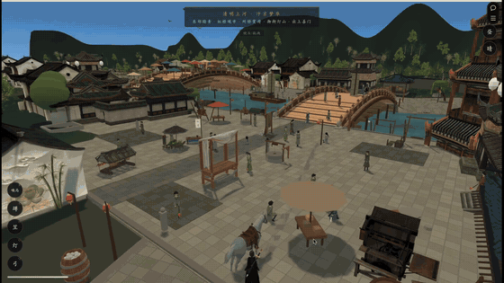
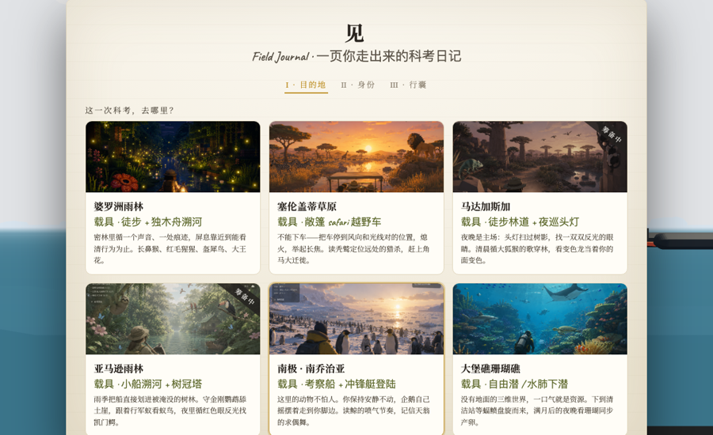
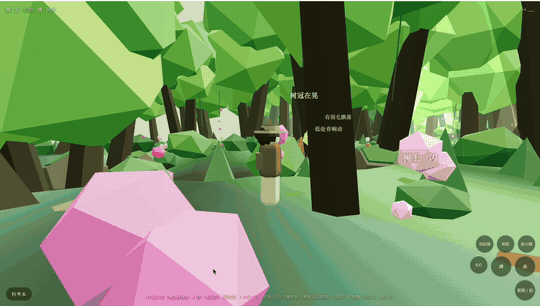
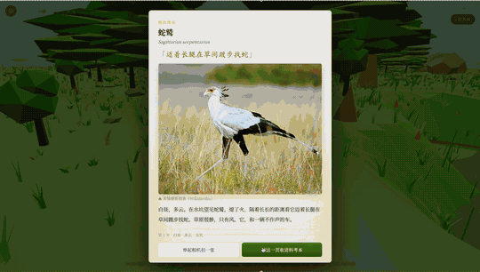
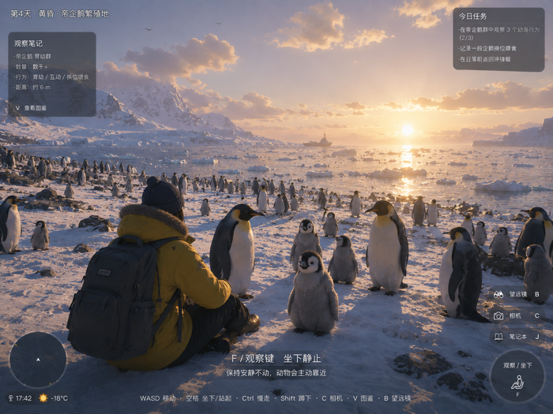
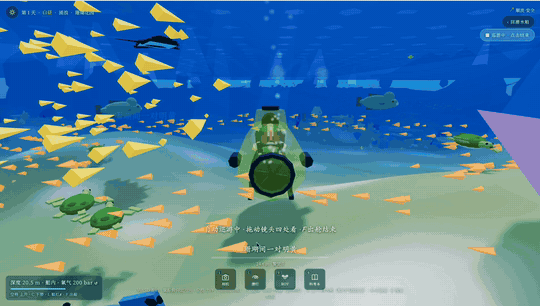
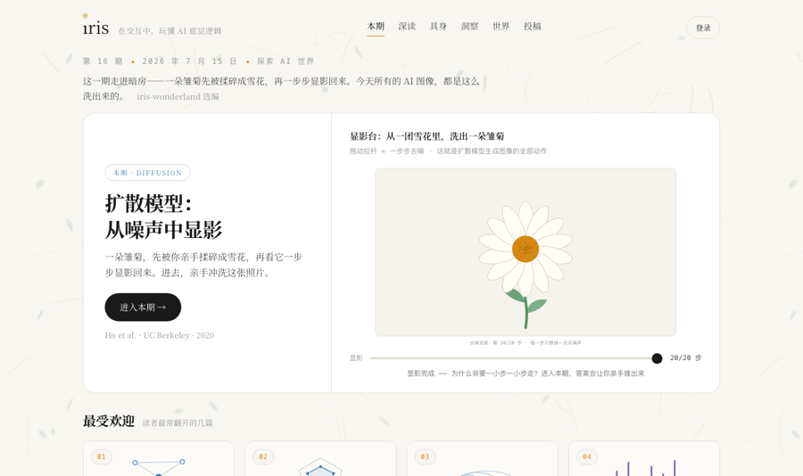

<h1 align="center">陈小爷 · witch-Judy</h1>

  做能在浏览器里直接打开的游戏与产品 · 打开即玩，无需下载 
  <i>Games and products that live in the browser — no install, just click and play.</i>

---

## ⚔️ 此间江湖 · This Is Jianghu

  

一座江南宅院、一张揭榜的告示。骑马穿过长桥与市集，在灯下听人说话，把序章走完。

<i>A courtyard in the south, a notice posted on the wall. Ride across the bridge and through the market, listen to people talk under the lanterns, and walk the prologue to its end.</i>

**▶️ [点此试玩 / Play now — this-is-jianghu.vercel.app](https://this-is-jianghu.vercel.app)**

---

## 🌿 见 · Field Journal —— 野外探索系列 / Wildlife Expedition Series

  

一页你走出来的科考日记。选一处目的地、带上装备，开着越野车、划着独木舟或潜下水，去找、去看、去记录野生动物。四处目的地，四套玩法。

<i>A field journal you write with your own footsteps. Pick a destination and your gear — drive out, paddle upriver, or dive down — then find the wildlife, watch it, and log it. Four destinations, four ways to play.</i>

<table>
<tr>
<td width="50%" align="center">
  
   <b>🌴 <a href="https://rainforest-game.vercel.app/index.html">婆罗洲雨林 · Borneo</a></b> 
  徒步 + 独木舟溯河 · 循着一个声音、一处痕迹，屏息靠近 
  <i>Trek and paddle a dugout canoe upriver — follow a sound, a track, and hold your breath.</i>
</td>
<td width="50%" align="center">
  
   <b>🦁 <a href="https://rainforest-game.vercel.app/serengeti.html">塞伦盖蒂草原 · Serengeti</a></b> 
  敞篷越野车 · 熄火举起长焦，等狮子走近 
  <i>Open-top safari jeep — cut the engine, raise the lens, wait for the lions.</i>
</td>
</tr>
<tr>
<td width="50%" align="center">
  
   <b>🐧 <a href="https://rainforest-game.vercel.app/antarctic.html">南极 · 南乔治亚 / South Georgia</a></b> 
  考察船 + 冲锋艇登陆 · 企鹅会自己摇摆着走到你脚边 
  <i>Arrive by research vessel and zodiac — the penguins waddle right up to your boots.</i>
</td>
<td width="50%" align="center">
  
   <b>🐠 <a href="https://rainforest-game.vercel.app/reef.html">大堡礁珊瑚礁 · Great Barrier Reef</a></b> 
  自由潜 / 水肺下潜 · 蝠鲼盘旋，满月后珊瑚同步产卵 
  <i>Freedive or scuba — manta rays circling, corals spawning after the full moon.</i>
</td>
</tr>
</table>

**▶️ [全部目的地入口 / All destinations — rainforest-game.vercel.app](https://rainforest-game.vercel.app)**

---

## 🌱 Iriseed · 探索 AI 的交互奇境

  

在交互中，玩懂 AI 底层逻辑。把 Transformer、GPT、扩散模型、GAN 这些经典论文做成可以亲手拨弄的交互文章——拖动滑杆看注意力如何分配，亲手当一次标注员理解 RLHF。不用数学背景，先玩，再真的懂。

<i>Understand how AI actually works by playing with it. Landmark papers — Transformer, GPT, diffusion models, GANs — rebuilt as hands-on interactive articles: drag a slider to watch attention shift, label a batch yourself to feel what RLHF is. No math background needed; play first, understand for real after.</i>

**▶️ [进入 / Visit — iriseed.com](https://iriseed.com)**

---

  💡 建议用电脑 Chrome 打开，体验最佳 · <i>Best experienced on desktop Chrome</i> 
  小红书同名「陈小爷」｜作品源码暂未开源 · <i>Source code not public for now</i>

