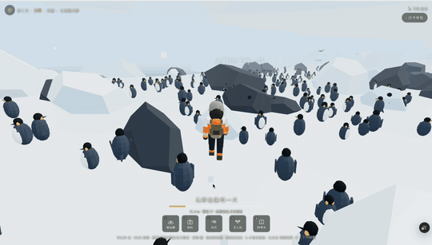

<h1 align="center">陈小爷 · witch-Judy</h1>

  欢迎来到我的创作空间。 
  以下每一个作品，都是点开网页即可进入的探索世界。
  I build playable worlds with AI.

  <i>Welcome to my creative space. 
  Each project below is an explorable world you can enter directly in your browser.</i>

  浏览器游戏 · 互动叙事 · AI 原生产品 · Creative Coding

---

## ⚔️ 此间江湖 · This Is Jianghu

  

一款以《清明上河图》与北宋汴京为灵感的浏览器武侠游戏。

玩家将扮演年轻游侠陈昭，揭榜、骑马、潜行、出剑，穿过虹桥、市集、酒楼与州桥夜市，在一幅可以自由行走的「汴京长卷」里经历她的江湖。

序章发生在临河县的一个雨夜。三十七户百姓的田契被夺，联名状即将焚毁。陈昭为四十两揭下私榜，夜入同知宅，取回田契与底册。

她起初相信，一柄剑足以管尽天下不平。后来，她会亲手建起屋舍、药坊、学堂和水上市场——

**既然世上没有她想要的江湖，那她就亲手造一个。**

<i>A browser-based wuxia game inspired by the Northern Song capital and <b>Along the River During the Qingming Festival</b>. Play as Chen Zhao, a young wandering swordswoman. Take bounties, ride across Bianjing, sneak over tiled rooftops, draw your sword, and walk through a living scroll of bridges, markets, taverns and lantern-lit night stalls. She begins believing a single sword can right every wrong — and ends up building houses, apothecaries, schools and a floating market with her own hands. If the jianghu she wants doesn't exist, she will build it herself.</i>

**▶ 开始游戏 / Play now — [this-is-jianghu.vercel.app/jianghu.html](https://this-is-jianghu.vercel.app/jianghu.html)**

---

## 🌿 见 · Field Journal

  

一页由你的脚步写成的野外科考日记。

选择目的地、带上装备，开着越野车、划着独木舟或潜入海底。循着声音与足迹寻找野生动物，观察它们，并把相遇记录下来。

**四处目的地，四种探索方式。**

<i>A field journal written with your own footsteps. Choose a destination and your gear, then drive, paddle or dive into the wild. Follow sounds and tracks, observe wildlife, and record each encounter. Four destinations, four ways to explore.</i>

<table>
<tr>
<td width="50%" align="center">
  
   <b>🌴 <a href="https://rainforest-game.vercel.app/index.html">婆罗洲雨林 · Borneo</a></b> 
  徒步与独木舟溯河，循着声音和痕迹靠近雨林动物 
  <i>Trek and paddle upriver, closing in on rainforest life by sound and track.</i>
</td>
<td width="50%" align="center">
  
   <b>🦁 <a href="https://rainforest-game.vercel.app/serengeti.html">塞伦盖蒂草原 · Serengeti</a></b> 
  驾驶敞篷越野车，熄火举起长焦，等待狮群走近 
  <i>Drive an open-top jeep, cut the engine, raise the lens, wait for the pride.</i>
</td>
</tr>
<tr>
<td width="50%" align="center">
  
   <b>🐧 <a href="https://rainforest-game.vercel.app/antarctic.html">南极·南乔治亚 · South Georgia</a></b> 
  搭乘考察船与冲锋艇登陆，走进企鹅栖息地 
  <i>Arrive by research vessel and zodiac, and walk into a king penguin colony.</i>
</td>
<td width="50%" align="center">
  
   <b>🐠 <a href="https://rainforest-game.vercel.app/reef.html">大堡礁 · Great Barrier Reef</a></b> 
  自由潜或水肺下潜，观察蝠鲼与珊瑚同步产卵 
  <i>Freedive or scuba to watch manta rays and the corals' synchronized spawning.</i>
</td>
</tr>
</table>

**▶ 开始探索 / Explore all destinations — [rainforest-game.vercel.app](https://rainforest-game.vercel.app)**

---

## 🌱 Iriseed · AI Interactive Playground

  

一个通过互动体验理解 AI 的知识游乐园。

我把 Transformer、GPT、扩散模型和 GAN 等经典概念，做成可以亲手操作的交互文章：拖动滑杆观察注意力如何变化，亲手完成一次数据标注，从体验中理解 RLHF。

**不要求数学背景。先玩，然后真正理解。**

<i>An interactive playground for understanding how AI works. Explore landmark ideas such as Transformers, GPT, diffusion models and GANs through hands-on experiences. No advanced math required. Play first, understand for real after.</i>

**▶ 进入 Iriseed / Visit — [iriseed.com](https://iriseed.com)**

---

## 🐈‍⬛ 跟屁猫 · Cursor Cat

  

一只跟着你鼠标走的小黑猫,和一份教你亲手做一只的手记。

打开网页,它坐在那里盯着你的光标看;往下滚,它就迈着腿跟过来陪你读完。你手停下三秒,它会蜷成一团睡着。

它是用三段 AI 生成的视频做出来的——坐姿、走路、睡觉,各管一件事。手记把整个流程拆成四步讲清楚:**想清楚它会做什么 → 生成三段视频 → 交给 AI 处理成精灵图 → 告诉 AI 你要的效果**。

**全程不用写代码,但你需要知道该提什么要求。**

<i>A little black cat that follows your cursor — and a build log teaching you to make your own. It watches your pointer, trots after you as you scroll, and curls up asleep when you stop moving. Built from three AI-generated clips (sitting, walking, sleeping), turned into a sprite sheet. The write-up breaks it into four steps you can follow without writing a line of code. Also ships as a Chrome extension and a macOS desktop pet.</i>

**▶ 打开手记 / Read it — [follow-cat.vercel.app](https://follow-cat.vercel.app)** · 源码 / Source — [github.com/witch-Judy/cursor-cat](https://github.com/witch-Judy/cursor-cat)

---

## About

我是陈小爷，一名独立 Builder。

我喜欢把历史、自然、AI 和故事，做成真正可以进入、操作和探索的数字世界。这里记录的不是产品概念，而是已经可以在浏览器里打开的作品。

<i>I'm an independent builder creating explorable worlds at the intersection of games, storytelling, AI and the web.</i>

  💡 建议使用电脑端 Chrome 体验 · <i>Best experienced on desktop Chrome.</i> 
  小红书同名：陈小爷

