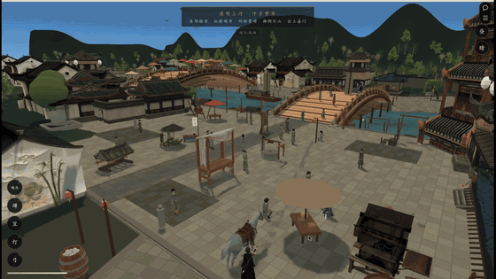
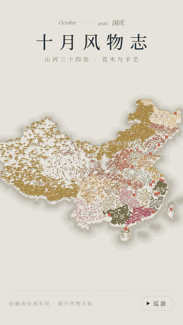
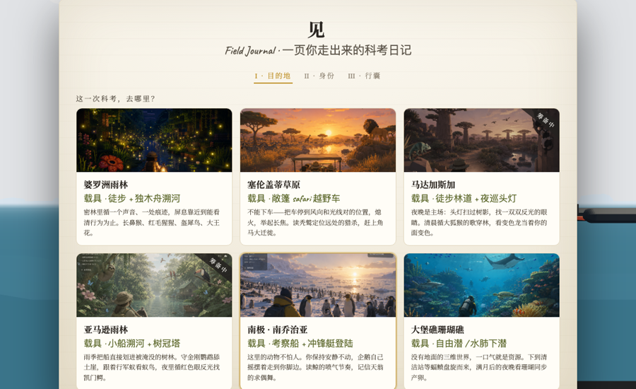
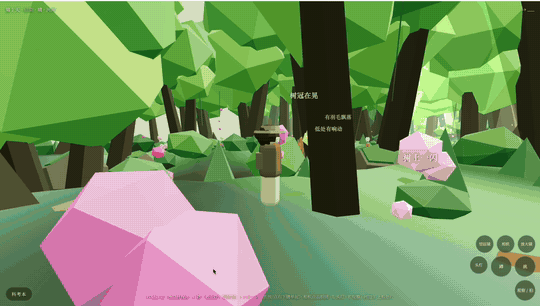
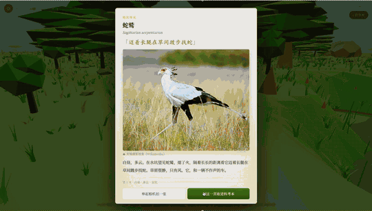
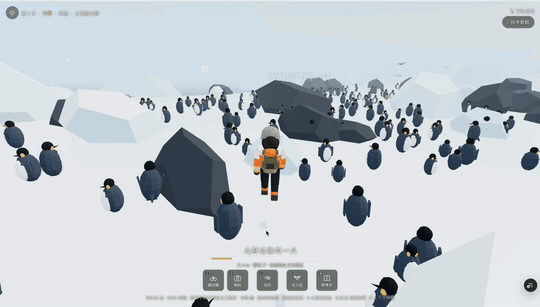
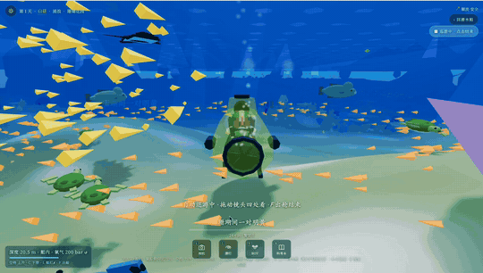
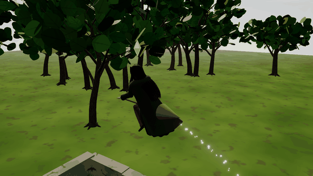
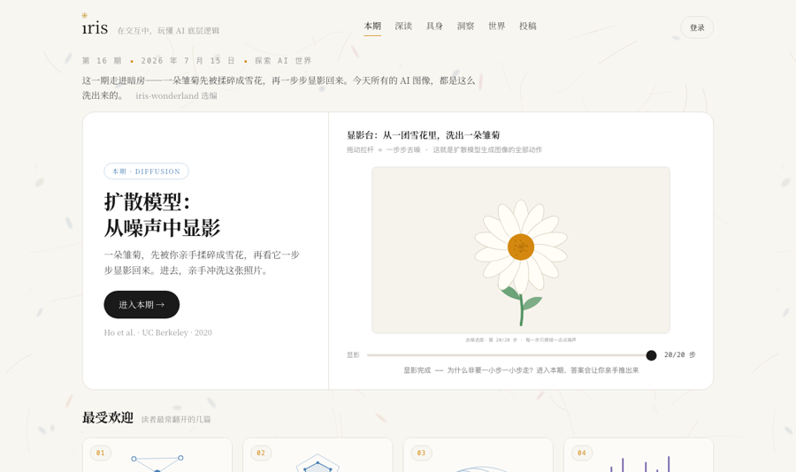

<h1 align="center">陈小爷 · witch-Judy</h1>

  欢迎来到我的创作空间。 
  以下每一个作品，都是点开网页即可进入的探索世界。
  I build playable worlds with AI.

  <i>Welcome to my creative space. 
  Each project below is an explorable world you can enter directly in your browser.</i>

  浏览器游戏 · 互动叙事 · AI 原生产品 · Creative Coding

---

## ⚔️ 此间江湖 · This Is Jianghu

  

一款以《清明上河图》与北宋汴京为灵感的浏览器武侠游戏。

玩家将扮演年轻游侠陈昭，揭榜、骑马、潜行、出剑，穿过虹桥、市集、酒楼与州桥夜市，在一幅可以自由行走的「汴京长卷」里经历她的江湖。

序章发生在临河县的一个雨夜。三十七户百姓的田契被夺，联名状即将焚毁。陈昭为四十两揭下私榜，夜入同知宅，取回田契与底册。

她起初相信，一柄剑足以管尽天下不平。后来，她会亲手建起屋舍、药坊、学堂和水上市场——

**既然世上没有她想要的江湖，那她就亲手造一个。**

<i>A browser-based wuxia game inspired by the Northern Song capital and <b>Along the River During the Qingming Festival</b>. Play as Chen Zhao, a young wandering swordswoman. Take bounties, ride across Bianjing, sneak over tiled rooftops, draw your sword, and walk through a living scroll of bridges, markets, taverns and lantern-lit night stalls. She begins believing a single sword can right every wrong — and ends up building houses, apothecaries, schools and a floating market with her own hands. If the jianghu she wants doesn't exist, she will build it herself.</i>

**▶ 开始游戏 / Play now — [this-is-jianghu.vercel.app/jianghu.html](https://this-is-jianghu.vercel.app/jianghu.html)**

---

## 🍂 十月风物志 · October Field Guide

  

一张会开花的三维中国地图，一本国庆出游的十月手帖。

全国三十四处，每一处都种满它十月的花木：香山的黄栌、满觉陇的丹桂、额济纳的胡杨、盘锦的红海滩。点开一处，花从中心一圈圈绽开，再翻开一页手帖——当季花木、两处宜游，和一门值得专程去看的手艺：景泰蓝、龙泉青瓷、白族扎染、唐卡、潍坊风筝……

**手艺模型来自文物三维扫描、博物馆开放馆藏与 AI 建模，花木全部用代码一笔笔画出。**

<i>A blooming 3D map of China and a field guide for the October holidays. Thirty-four regions, each planted with its own October flora — smoke trees of Fragrant Hills, osmanthus of Hangzhou, golden poplars of Ejina, the red seepweed beach of Panjin. Tap a region and its plants burst into bloom from the center outward, then a card opens with the season's flora, two places to go, and one craft worth the trip: cloisonné, Longquan celadon, Bai tie-dye, thangka, Weifang kites and more. Craft models come from museum 3D scans, open-access collections and AI modeling; every plant is drawn in code.</i>

**▶ 打开地图 / Explore — [october-fengwuzhi.vercel.app](https://october-fengwuzhi.vercel.app)** · 美术资产 / Asset gallery — [october-fengwuzhi.vercel.app/october-3d/assets.html](https://october-fengwuzhi.vercel.app/october-3d/assets.html)

---

## 🌿 见 · Field Journal

  

一页由你的脚步写成的野外科考日记。

选择目的地、带上装备，开着越野车、划着独木舟或潜入海底。循着声音与足迹寻找野生动物，观察它们，并把相遇记录下来。

**四处目的地，四种探索方式。**

<i>A field journal written with your own footsteps. Choose a destination and your gear, then drive, paddle or dive into the wild. Follow sounds and tracks, observe wildlife, and record each encounter. Four destinations, four ways to explore.</i>

<table>
<tr>
<td width="50%" align="center">
  
   <b>🌴 <a href="https://rainforest-game.vercel.app/index.html">婆罗洲雨林 · Borneo</a></b> 
  徒步与独木舟溯河，循着声音和痕迹靠近雨林动物 
  <i>Trek and paddle upriver, closing in on rainforest life by sound and track.</i>
</td>
<td width="50%" align="center">
  
   <b>🦁 <a href="https://rainforest-game.vercel.app/serengeti.html">塞伦盖蒂草原 · Serengeti</a></b> 
  驾驶敞篷越野车，熄火举起长焦，等待狮群走近 
  <i>Drive an open-top jeep, cut the engine, raise the lens, wait for the pride.</i>
</td>
</tr>
<tr>
<td width="50%" align="center">
  
   <b>🐧 <a href="https://rainforest-game.vercel.app/antarctic.html">南极·南乔治亚 · South Georgia</a></b> 
  搭乘考察船与冲锋艇登陆，走进企鹅栖息地 
  <i>Arrive by research vessel and zodiac, and walk into a king penguin colony.</i>
</td>
<td width="50%" align="center">
  
   <b>🐠 <a href="https://rainforest-game.vercel.app/reef.html">大堡礁 · Great Barrier Reef</a></b> 
  自由潜或水肺下潜，观察蝠鲼与珊瑚同步产卵 
  <i>Freedive or scuba to watch manta rays and the corals' synchronized spawning.</i>
</td>
</tr>
</table>

**▶ 开始探索 / Explore all destinations — [rainforest-game.vercel.app](https://rainforest-game.vercel.app)**

---

## 🧹 一丝不苟的魔女的家 · Methodical Witch's House

  

一座住着年轻魔女薇拉的半木结构小屋，和一片被打理得井井有条的庭园。

像《模拟人生》一样照看她的日常：点一下地面，她就走过去；点一下家具，她会读书、写魔法笔记、在壁炉前熬药、从井里打水去浇菜、喂鸡、推开窗户。熬好的魔药会摆在餐桌上，喝下去也许会让她飘起来。

墙壁可以剖开看屋内，时间会从清晨流到深夜。累了就让她骑上扫帚，飞过菜畦、药草园和院外的森林——你也可以切到自由视角，从高空俯瞰整座小院。

**房屋、家具、植物和魔女，全部用代码一点点搭出来。**

<i>A little half-timbered cottage and a meticulously kept garden, home to a young witch named Vera. Look after her day the way you would in The Sims: click the ground and she walks there; click furniture and she reads, writes spell notes, brews potions by the fireplace, draws water from the well to water the vegetables, feeds the chickens, opens the windows. Finished potions appear on the dining table — drink one and she might start to float. Cut away the walls to peek inside, watch the day turn from dawn to night, then send her off on her broom over the garden and the forest beyond — or switch to free camera and take in the whole place from above. Built entirely in code with three.js WebGPU and TSL: the house, the furniture, every plant, and the witch herself.</i>

**▶ 进入小屋 / Play now — [witch-house-tawny.vercel.app](https://witch-house-tawny.vercel.app)**

---

## 🌱 Iriseed · AI Interactive Playground

  

一个通过互动体验理解 AI 的知识游乐园。

我把 Transformer、GPT、扩散模型和 GAN 等经典概念，做成可以亲手操作的交互文章：拖动滑杆观察注意力如何变化，亲手完成一次数据标注，从体验中理解 RLHF。

**不要求数学背景。先玩，然后真正理解。**

<i>An interactive playground for understanding how AI works. Explore landmark ideas such as Transformers, GPT, diffusion models and GANs through hands-on experiences. No advanced math required. Play first, understand for real after.</i>

**▶ 进入 Iriseed / Visit — [iriseed.com](https://iriseed.com)**

---

## 🐈‍⬛ 跟屁猫 · Cursor Cat

  

一只跟着你鼠标走的小黑猫

<i>A little black cat that follows your cursor — and a build log teaching you to make your own. It watches your pointer, trots after you as you scroll, and curls up asleep when you stop moving. Built from three AI-generated clips (sitting, walking, sleeping), turned into a sprite sheet. The write-up breaks it into four steps you can follow without writing a line of code. Also ships as a Chrome extension and a macOS desktop pet.</i>

**▶ 打开手记 / Read it — [follow-cat.vercel.app](https://follow-cat.vercel.app)** · 源码 / Source — [github.com/witch-Judy/cursor-cat](https://github.com/witch-Judy/cursor-cat)

---

## About

我是陈小爷，一名独立 Builder。

我喜欢把历史、自然、AI 和故事，做成真正可以进入、操作和探索的数字世界。这里记录的不是产品概念，而是已经可以在浏览器里打开的作品。

<i>I'm an independent builder creating explorable worlds at the intersection of games, storytelling, AI and the web.</i>

  💡 建议使用电脑端 Chrome 体验 · <i>Best experienced on desktop Chrome.</i> 
  小红书同名：陈小爷

